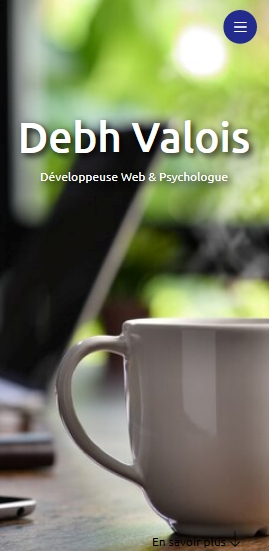

<h1 align="center">
  
  PORTFÓLIO
</h1>

 Status <☕> Update 03 junho 2023 <☕/>

## Descrição:
- Sobre mim | Competências | Meu CV | Portfólio | Contato

 

## 📁 Acessibilidade:
- Para ler os códigos-fonte, basta acessá-los diretamente neste repositório.
- Para acessar a página, clique na imagem abaixo com o botão direito do mouse para abrir em uma nova aba:
<table align="center">
  <tr>
    <td>
      
    </td>
  </tr>
</table>

 

## 🛠️ Tecnologias utilizadas:
- ``JavaScript``
- ``HTML5``
- ``CSS3``
- ``Bootstrap``

 

## :octocat: Dev: 
<table>
  <tr>
    <td align="center">
      <a href="#">
         
        
          <b>Debh Valois</b>
        
      </a>
    </td>
  </tr>
</table>

